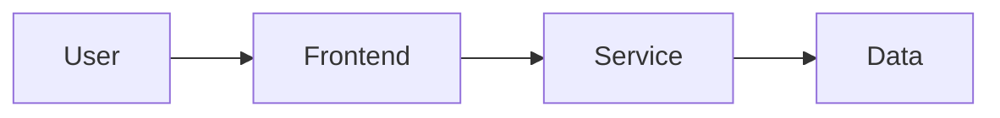

# [Architecture name]

## Scope and goals

[System boundary, requirements, quality attributes, and non-goals.]

## Context and data flow

## Components and ownership

| Component | Responsibility | Owner | Trust boundary | Failure concern |
| --- | --- | --- | --- | --- |
| [Component] | [Role] | [Owner] | [Boundary] | [Concern] |

## Current or target behavior

[Label each statement as implemented, proposed, or not verified.]

## Decisions and trade-offs

[Link ADRs and summarize rationale.]

## Operations and security

[Observability, recovery, access, data protection, cost, and compliance considerations.]
