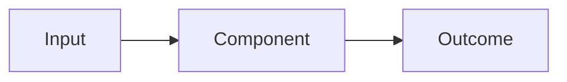

# [Explanation title]

## Context

[Why this topic matters and who needs to understand it.]

## Mental model

[Core concepts and relationships.]

## Why the system works this way

[Constraints, requirements, and design rationale.]

## Alternatives and trade-offs

| Option | Benefits | Costs or risks | When it fits |
| --- | --- | --- | --- |
| [Option] | [Benefits] | [Costs] | [Use case] |

## Consequences and boundaries

[Operational, security, cost, reliability, and ownership implications.]

## Related decisions and procedures

- [ADR]
- [How-to]
- [Reference]
